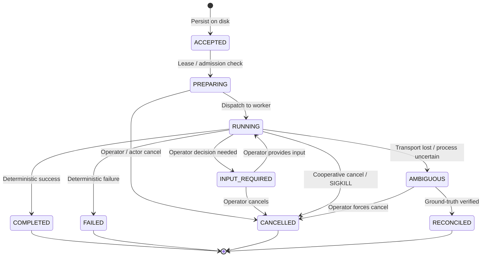

# ADR-0001 — Durable Task Execution and Identity

Status: Accepted
Date: 2026-10-05
Decision owners: DEX//REACH project

## Context

In DEX//REACH 0.3.x and earlier, operation tracking at the gateway was transient: operations existed only in memory maps (`pendingOperations`, `resultMap`) tied to active HTTP/WebSocket transport connections. When a client disconnected, a network timeout occurred, or the gateway restarted, in-flight state was lost even if the underlying node was still executing child processes or local plans.

For DEX// 1.0 Control System and DEX//REACH 0.4 Durable Execution, operations must possess durable identity, survivability across transport disruptions, restart tolerance, explicit lineage, and deterministic state transitions. We must define the task model, authority hierarchy, identifier schema, lifecycle transitions, and persistence ordering before implementing storage in Phase C2.

## Decision

### 1. Authority Hierarchy: Node is Final Execution Authority

The node where execution occurs is the sole and final authority on task status, lifecycle transitions, and execution outcomes.
- Neither the gateway, nor the client assistant, nor an intermediate proxy may declare a task completed, failed, or retried on its own authority.
- The gateway acts purely as an authenticated message router and subscription relay; it maintains a read projection of task state but cannot authoritatively transition task states.
- If the gateway loses connection to a node, the gateway must report the connection as severed; it MUST NOT transition the task to `FAILED` or `CANCELLED`.

### 2. Globally Safe Task Identifier Format

All task identifiers must adhere to a globally safe, URL-safe, filesystem-safe, and log-safe format:

```text
Format: rtsk_<timestamp_ms_hex>_<random_entropy_hex>
Regex:  ^rtsk_[0-9a-f]{11,13}_[0-9a-f]{16,32}$
Example: rtsk_01925b6a7c8d_3f8a9e2b1c4d5e6f
```

Characteristics:
- Prefix `rtsk_` explicitly denotes a REACH durable task record.
- Hexadecimal millisecond timestamp ensures rough chronological sortability without exposing microsecond host clock jitter.
- Minimum 64 bits (16 hex chars) of cryptographic randomness prevents collisions across concurrent nodes.
- Excludes characters requiring URL escaping, shell quoting, or path separators (`/`, `\`, `?`, `&`, ` `, `:`, `.`).

### 3. Lineage and Lineage Depth

Tasks form explicit parent-child execution hierarchies:
- `rootTaskId`: Identifies the top-level originating task. If the task has no parent, `rootTaskId` equals its own `taskId`.
- `parentTaskId`: Identifies the immediate parent task handle, or `null` for root tasks.
- `taskDepth`: Integer depth in the lineage tree (`0` for root tasks, `maxDepth = 8` hard ceiling to prevent recursion bombs).
- `lineageIndex`: Deterministic sequence index within siblings under the same `parentTaskId`.

### 4. Actor and Node Binding

Every durable task is immutably bound at creation to:
1. `actorId`: Authenticated actor identity (`oauth_client_id`, local owner key hash, or machine identity).
2. `nodeId`: Exact canonical `node_id` where the task must execute.
   - **DEX-INV-001 Invariant**: A task CANNOT float across nodes or migrate dynamically.
   - If a node is offline or revoked, tasks bound to it remain queued or fail on that node; another node CANNOT claim the task without creating an explicit new descendant task.
3. `repoContext`: When execution targets a workspace, the task record immutably binds:
   - `canonicalRepo`: e.g. `westkitty/DEX`
   - `repoPath`: Absolute filesystem path
   - `worktreeBranch`: Git branch name at creation
   - `baseSha`: Expected Git commit SHA at creation
   - `leaseId`: Coordinator lease ticket ID (satisfying `DEX-INV-020` and `DEX-INV-023`).

### 5. Task Lifecycle State Machine

A task transitions through the following exact states:



#### Legal Transition Matrix

| Current State | Allowed Next States | Trigger / Condition |
| :--- | :--- | :--- |
| `ACCEPTED` | `PREPARING`, `CANCELLED` | Durable write verified -> Lease acquisition |
| `PREPARING` | `RUNNING`, `CANCELLED`, `FAILED` | Admission granted -> Dispatch; or admission refused/cancelled |
| `RUNNING` | `INPUT_REQUIRED`, `AMBIGUOUS`, `COMPLETED`, `FAILED`, `CANCELLED` | Consequential gate, uncertainty event, exit code 0, exit code != 0, cancel signal |
| `INPUT_REQUIRED` | `RUNNING`, `CANCELLED` | Decision received -> Resume; or cancelled |
| `AMBIGUOUS` | `RECONCILED`, `CANCELLED` | Reconciliation probe proves ground truth; or explicit force cancel |
| `COMPLETED` | *None (Terminal)* | Immutable outcome. |
| `FAILED` | *None (Terminal)* | Immutable outcome. |
| `CANCELLED` | *None (Terminal)* | Immutable outcome. |
| `RECONCILED` | *None (Terminal)* | Immutable outcome (reconciliation proof attached). |

Any transition not explicitly listed in this table is an illegal transition and MUST fail closed.

### 6. Creation and Persistence Ordering

**Strict Ordering Invariant**: A task handle is NEVER returned to a caller, and execution NEVER begins, before the initial task record is durably written to the node's local filesystem with sync/flush confirmation.
1. Inbound request arrives at node.
2. Node assigns `taskId`, validates actor and arguments against local policy (`DEX-INV-002`).
3. Node writes task record to `TaskStore` in state `ACCEPTED` with file lock and fsync.
4. ONLY after storage confirmation is the `taskId` handle returned to caller and passed to execution engine.
5. If storage write fails, node returns immediate refusal without executing.

### 7. INPUT_REQUIRED Semantics

- When a task encounters a consequential operation requiring human authorization (e.g. `+SHIP`, destructive deletion, unconfirmed plan commit, or "Needs Andrew" gate), it enters `INPUT_REQUIRED`.
- The task yields its active substantive worker slot (`DEX-INV-024`) to prevent blocking machine capacity.
- The task retains its coordination lease in a paused reservation state with an explicit expiration deadline (`inputDeadlineUtc`).
- `INPUT_REQUIRED` does NOT count against the task's retry attempt budget.
- If the deadline expires without input, the task transitions to `CANCELLED` (reason: `INPUT_TIMEOUT`).

### 8. AMBIGUOUS Semantics

**Universal Invariant**: A client or network timeout DOES NOT prove that execution stopped.
- If communication between caller and node is lost, or if the node daemon restarts while a child subprocess was executing, the outcome is uncertain.
- If an operation could have produced external side effects (API calls, file modifications, git commits) and cannot be verified via clean exit receipt, the state MUST become `AMBIGUOUS`.
- A task in `AMBIGUOUS` is strictly forbidden from automatic retry or blind replay.
- `AMBIGUOUS` requires reconciliation (probe inspection) before any further progression.

### 9. Cancellation Semantics

- Cancellation may be requested only by the originating `actorId` or the local machine owner.
- Cancellation follows a two-stage cooperative protocol:
  1. Node sends cooperative cancel token / SIGINT to the running execution unit.
  2. If the task does not terminate within `gracePeriodMs` (default 5000ms), node issues SIGKILL to the process group.
- The terminal state is `CANCELLED`. A cancelled task cannot be resumed; new work requires a new linked task.

### 10. Result Ownership and Content Separation

- Task records distinguish public summaries from sensitive execution payloads:
  - `TaskSummary`: Contains `taskId`, state, timestamps, actor, node, operation name, redacted status message. Accessible via share-safe interfaces.
  - `TaskPayload`: Contains arguments, raw output, file paths, and environment variables. Stored in owner-private files (mode `0600`).
  - Output results exceeding 64 KiB are stored in separate chunked blob storage with content-addressed SHA-256 references, preventing memory exhaustion.

### 11. Transport Session Independence

A task is completely decoupled from the transport session:
- A task outlives HTTP request-response lifecycles, MCP client connections, WebSocket reconnections, and gateway daemon restarts.
- Clients reconnect by presenting their authenticated `actorId` and querying `task_status(taskId)` or subscribing to task events.

## Consequences

### Positive
- System behavior remains deterministic across network interruptions and crashes.
- Impossible to accidentally rerun non-idempotent or destructive processes on timeout.
- Clean audit trail with unbroken causal lineage.
- Strict compliance with `DEX-INV-001`, `DEX-INV-002`, `DEX-INV-010`, `DEX-INV-020`, `DEX-INV-024`.

### Costs / Tradeoffs
- Requires local disk write (fsync) before returning task response, adding a ~1-3ms latency overhead at task submission.
- Tasks in `AMBIGUOUS` require explicit reconciliation workflows rather than simple automatic recovery.

## Validation
1. Fixture tests verifying valid task records and rejecting invalid states or missing `node_id`.
2. State machine tests proving rejection of illegal state transitions (e.g. `COMPLETED -> RUNNING`, `ACCEPTED -> COMPLETED`).
3. Timeout simulation tests proving transition to `AMBIGUOUS` rather than blind retry.

## Revisit When
- Distributed multi-node consensus is introduced (beyond single-node authority).
- Operating system level sandboxing provides guaranteed zero-residual process tracking.

## Supersedes
None. (Foundational ADR for Phase C1).
